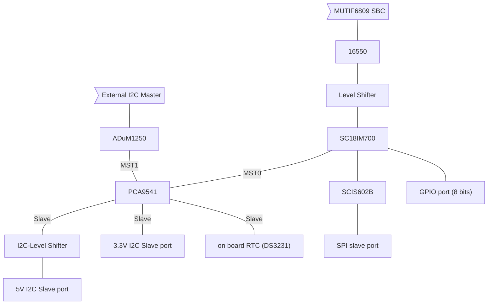

# MUTIF09 I/O Expansion Board (MUTIF09-IOEXP)

**Revision 3, works as expected (May 21, 2019)**

MUTIF09 I/O Expansion Board is designed to add I2C (5V and 3.3V), SPI (3.3V) and GPIO (data pins are 5V tolerant but 3.3V is preferable) connectivity and functionality via TTL serial connection. Basically, this board is intended for use together with the MUTIF09 6809 SBC but theoretically it can work with other single board computer with minimal modification.

MUTIF09 6809SBC sees this board as an additional asynchronous communication interface adapter (ACIA) and this board works as an interface between ACIA and the I2C- & SPI-bus. This allows the 6809 to communicate with other I2C- or SPI-bus deveices such as temperature sensor, Realtime clock, EEPROM, ADC, SRAM and so on through ACIA.

## Block Diagram

(You may need to install an extension, like *Markdown Preview Mermaid Support* to see this diagram correctly)

|Feature|Status|Implemented by using|
|-------|------|-------|
|Additional UART w/ FIFO|works|16550|
|UART-I2C (3.3 V, 5 V) bridge|works|SC18IM700, BSS138|
|UART-SPI (3.3 V) bridge|works|SC18IM700, SC18IS602B|
|GPIO (8 bit, 3.3 V)|works|SC18IM700|
|I2C-bus master selection*|works|PCA9541|
|On-board RTC|works|DS3231 w/ backup battery|
||||

## Memory Maps

|Address|Register|
|-------|--------|
|$B020|Receiver Buffer Reg. /Transmitter Holding Reg.|
|$B021|Interrupt Enable Reg./Interrupt Indent. Reg.|
|$B022|FIFO Control Reg.|
|$B023|Line Control Reg.|
|$B024|MODEM Control Reg.|
|$B025|Line Status Reg.|
|$B026|MODEM Status Reg.|
|$B027|Scratch Reg.|
|$B020|Divisor Latch (Lo byte) if MSB of Line Control Reg. is 1|
|$B021|Divisor Latch (Hi byte) if MSB of Line Control Reg. is 1|
|||

## Documentation

This board has many features and therefore, I think that it needs documentation and examples. In spite of this, document preparation is still underway. For now, please refer to the IC datasheets.